| 순서 | 섹션 | 핵심 내용 | 그래프/자료 |
|---|---|---|---|
| 1 | 기획 배경 | 시장성, 이용행태, 창작자 문제 정의 | `assets/data-bideo-*.png` |
| 2 | 데이터셋/피처 설계 | 학습 데이터 구성, 분포/상관 분석 | `Bideo-회귀_chart_1~3` |
| 3 | 분류 모델 | 저조회수/고조회수 분류, 임계값 조정 | `bideo-분류_chart_5/22/24` |
| 4 | 회귀 모델 | 조회수 예측, 오차/중요 피처 분석 | `Bideo-회귀_chart_4/5/6` |
| 5 | 유사도 추천 | Kiwi + TF-IDF 기반 콘텐츠 매칭 | `fastapi-slide-12.png` |
| 6 | LLM/RAG 분석 | Fast 모드 vs Hybrid RAG 모드 | `fastapi-slide-13.png` |
| 7 | 모델 비교/운영 | 기능별 모델 선택 기준과 운영 지표 | 비교표 + API 지표 |

# FastAPI AI 핵심 코드 발표 정리 (BIDEO 서비스 맞춤)

> 기준 프로젝트: `fastapi/workspaes/basic`  
> 목적: BIDEO 서비스의 AI 기능을 기획 근거부터 모델 비교까지 발표 순서로 한 번에 설명

## 발표용 한눈에 요약 (피처/분석 결과)

### 1) 어떤 피처를 사용했는가

- 반응 지표: `likes`, `comments`, `shares`, `engagement_score`
- 비율 지표: `like_ratio`, `comment_ratio`, `share_ratio`, `watch_completion_rate`
- 품질 지표: `ai_quality_score`, `quality_completion_score`
- 시간/신선도 지표: `age_days`, `upload_month`, `upload_dayofweek`, `upload_year`
- 경매 지표: `starting_bid`, `bid_count`, `bidder_count`, `final_bid_price`
- 안정화 피처: `log_likes`, `log_comments`, `log_shares`, `log_engagement_score`

### 2) 분석 결과 핵심

- EDA에서 조회수는 `likes/comments/shares`와 강한 양의 상관을 보였습니다.
- 회귀 모델은 실측 추세를 전반적으로 따라가며, 큰 오차는 일부 이상치 구간에서 발생했습니다.
- 피처 중요도는 `like_ratio`, `likes`, `log_likes` 계열이 상위로 나타났습니다.
- 분류 모델은 threshold 조정으로 precision/recall 균형을 목적에 맞게 제어할 수 있었습니다.
- 추천 모델은 Kiwi + TF-IDF 기반으로 콜드스타트에서도 동작 가능했습니다.
- LLM/RAG는 `fast_mode(속도)`와 `hybrid RAG(정밀도)`를 분리해 운영 목적에 맞춰 선택 가능합니다.

### 3) 서비스 적용 결론

- 단기: 조회수 예측 + 분류로 노출/추천 우선순위를 자동화
- 중기: 추천 CTR, 분류 F1, 회귀 RMSE를 함께 모니터링해 모델 개선 루프 운영
- 장기: 경매 RAG 리포트를 의사결정 보조 기능으로 고도화

## 1. 기획 배경 데이터 분석

### 1) 데이터로 본 문제 정의

GlobalGates의 출발점은 "중소기업이 해외에 진출하기 어렵다"는 감각적 주장에 두지 않고, 공개 통계 데이터로 먼저 문제를 검증하는 방식으로 접근했습니다.

### 2) 분석 질문

| 질문 | 확인하려는 내용 |
|---|---|
| 국내 기업 중 중소기업 비중은 어느 정도인가? | 서비스 대상이 충분히 큰가 |
| 수출 교역액도 중소기업 중심인가? | 실제 거래 성과가 어디에 집중되어 있는가 |
| 중소기업 수출은 줄고 있는가, 성장하고 있는가? | 플랫폼이 붙을 만한 성장 흐름이 있는가 |

### 3) 사용 데이터

| 데이터 | 출처 | 사용 목적 |
|---|---|---|
| 산업별·기업규모별 활동 기업 수 | 기업특성별무역통계 | 대기업/중소기업 활동 기업 수 비중 계산 |
| 기업규모별 수출입 통계 | 기업특성별무역통계 | 기업 규모별 수출 교역액 비중 계산 |
| 2015~2023 중소기업 수출 데이터 | 기업특성별무역통계 | 수출 참여 중소기업 수와 교역액 추이 확인 |

### 4) 분석 과정 1: 기업 수와 수출 교역액 비교

`n한 줄 해설: 콘텐츠 산업 매출이 꾸준히 증가해 서비스 시장성의 근거가 됩니다.
`n한 줄 해설: OTT 이용과 유료 전환이 함께 늘어 결제형 서비스 수요를 뒷받침합니다.
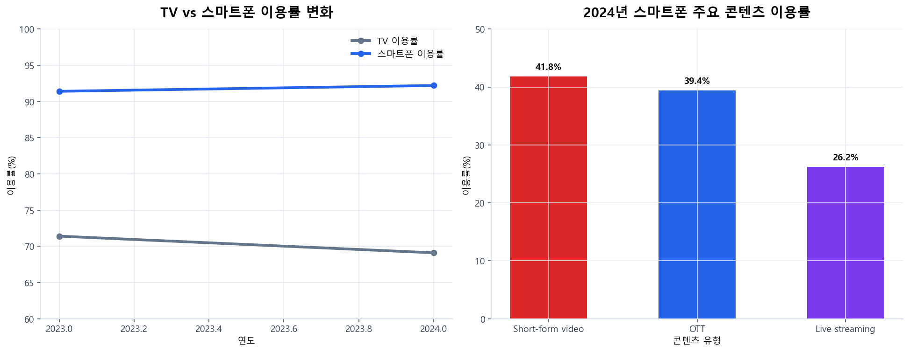`n한 줄 해설: 모바일·숏폼 중심 소비 패턴이 피드형 UX 전략과 맞닿아 있습니다.
`n한 줄 해설: 상위 집중 구조가 커서 창작자 수익 다변화 기능이 필요합니다.

- 시장 성장과 OTT 유료화 확대를 근거로 영상 콘텐츠 거래 서비스 타당성을 확보했습니다.
- 모바일/숏폼 중심 소비 패턴을 반영해 피드형 UX와 빠른 추천 응답을 우선 요구사항으로 잡았습니다.
- 창작자 수익 집중 문제를 해결하기 위해 조회수 외에 경매/결제 기반 수익모델을 함께 설계했습니다.

## 2. 데이터셋과 피처 설계

원본: `data-analysis/retrain_bideo_from_csv.py`, `data-analysis/retrain_bideo_from_db.py`

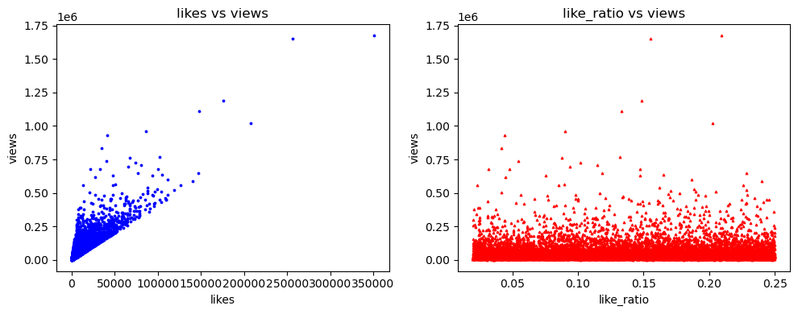`n한 줄 해설: 반응 지표가 커질수록 조회수도 함께 커지는 경향이 확인됩니다.
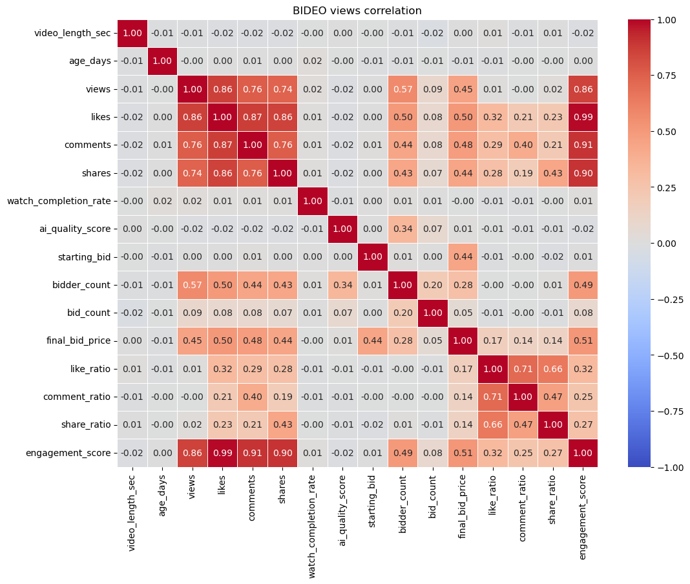`n한 줄 해설: 조회수는 likes/comments/shares와 높은 양의 상관을 보입니다.
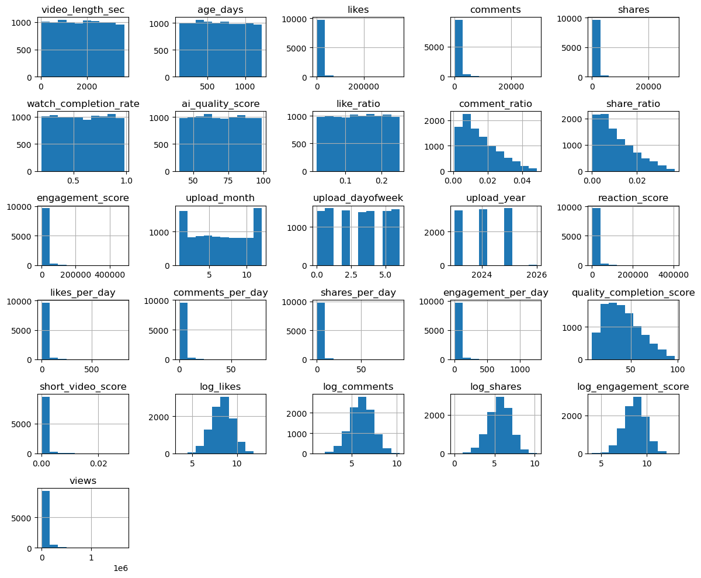`n한 줄 해설: 주요 변수 분포가 치우쳐 있어 로그/비율 피처가 필요합니다.

```python
# 서비스 입력 -> 모델 피처 벡터 정렬
feature_dict = features.model_dump()
values = [feature_dict[name] for name in self.work_regressor_features]
prediction = self.work_regressor.predict([values])
```

- 회귀/분류 공통으로 `likes`, `comments`, `shares`, `watch_completion_rate`, `ai_quality_score` 등 참여/품질 피처를 사용합니다.
- 로그 변환(`log_likes`, `log_comments`, `log_shares`)과 비율 피처(`like_ratio`, `comment_ratio`)로 heavy-tail 분포를 안정화했습니다.

## 3. 분류 모델 (고조회수 여부)

원본: `service/work_service.py`

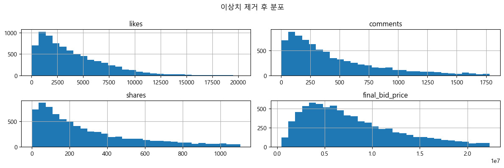`n한 줄 해설: 이상치 제거 후 분포가 안정화되어 분류 학습 품질이 개선됩니다.
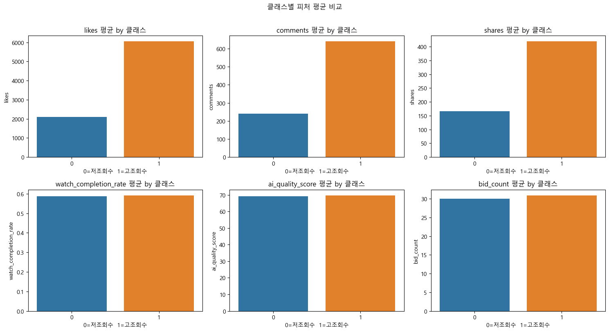`n한 줄 해설: 고조회수 클래스가 반응 지표 평균에서 뚜렷한 차이를 보입니다.
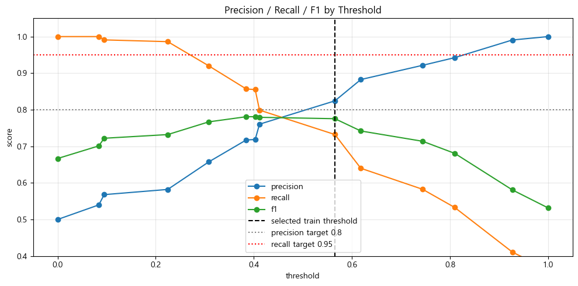`n한 줄 해설: threshold 조정으로 precision-recall 균형을 운영 목적에 맞게 선택할 수 있습니다.
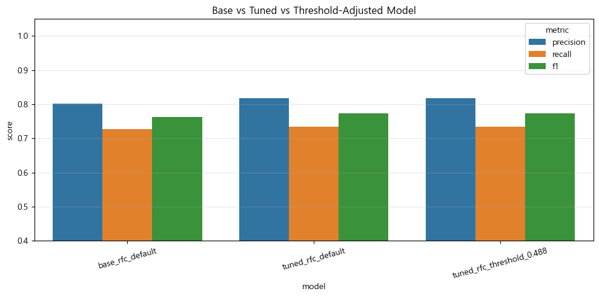`n한 줄 해설: 튜닝+임계값 조정 모델이 전체 균형 지표에서 가장 안정적입니다.

```python
# 분류 추론 후 threshold 기준으로 클래스 결정
prob = self.work_classifier.predict_proba([values])[0][1]
label = int(prob >= self.classification_threshold)
```

- 기본 분류기보다 튜닝 + threshold 조정 모델이 정밀도/재현율 균형이 안정적입니다.
- 운영에서는 캠페인 목적에 따라 threshold를 조정합니다.
  - 노출 확대: recall 우선
  - 오탐 최소화: precision 우선

## 4. 회귀 모델 (조회수 예측)

원본: `service/work_service.py`

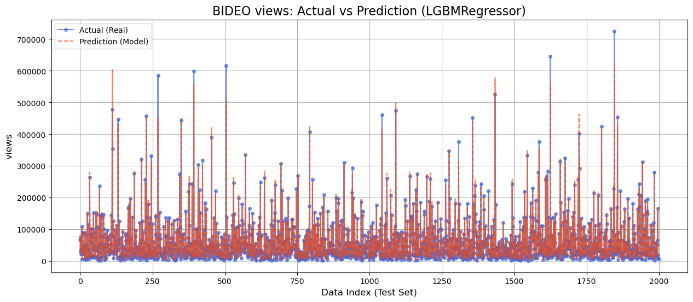`n한 줄 해설: 모델 예측이 실측 추세를 전반적으로 따라가며 실사용 가능 수준을 보입니다.
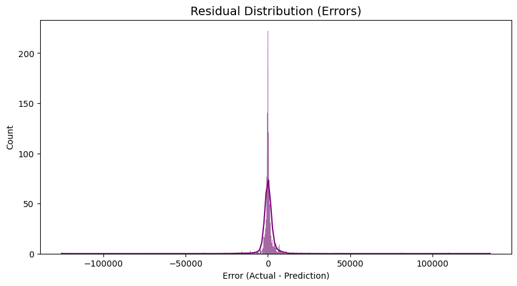`n한 줄 해설: 대부분 오차가 0 근처에 모여 평균적인 예측 편향은 크지 않습니다.
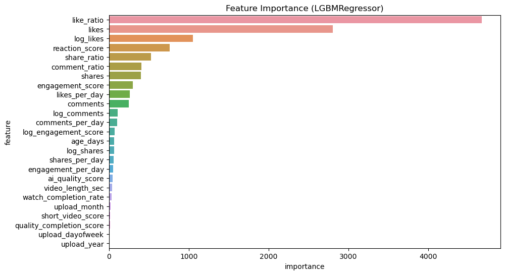`n한 줄 해설: like_ratio와 likes 계열이 조회수 설명력에 가장 크게 기여합니다.

```python
self.load_work_regressor()
prediction = self.work_regressor.predict([values])
return WorkRegressionResponse(predicted_views=int(prediction[0]))
```

- 실측-예측 그래프로 전체 추세 추종 성능을 검증하고, 잔차 분포로 과대/과소 예측 편향을 점검합니다.
- 중요도 분석 결과 `like_ratio`, `likes`, `log_likes` 계열이 핵심 설명 변수로 작동합니다.

## 5. 유사도 추천 모델

`n한 줄 해설: 텍스트 유사도 기반으로 사용자 취향과 가까운 콘텐츠를 우선 추천합니다.

원본: `service/work_recommend_service.py`

```python
tfidf_v = TfidfVectorizer(analyzer="char_wb", ngram_range=(2, 4), max_features=6000)
tfidf_mat = tfidf_v.fit_transform(work_texts)
query_mat = tfidf_v.transform([request.content])
sim_scores = cosine_similarity(query_mat, tfidf_mat)[0]
```

- Kiwi 전처리 + TF-IDF로 한국어 텍스트 유사도를 계산합니다.
- 콜드스타트 상황에서도 메타데이터 기반 추천이 가능해 초기 사용자 경험을 보완합니다.

## 6. LLM/RAG 분석 모델

`n한 줄 해설: fast 모드와 hybrid RAG를 분리해 속도와 정밀도 요구를 함께 대응합니다.

원본: `service/auction_rag_service.py`

```python
if request.fast_mode:
    return await self._analyze_fast(request)

rag_query = self._build_rag_query(request, image_analysis)
auction_report = await rag.aquery(rag_query, mode="hybrid")
```

- `fast_mode`: 검색 단계를 줄여 응답속도 우선.
- `hybrid RAG`: 문서 근거 기반으로 가격 매력도, ROI 시나리오, 입찰 전략을 상세 생성.

## 7. 모델 비교 및 운영 적용

| 기능 | 적용 모델 | 선택 이유 | 핵심 운영 지표 |
|---|---|---|---|
| 조회수 예측 | LGBM Regressor (`bideo_regressor.pkl`) | 비선형 관계/스케일 차이를 안정적으로 학습 | MAE, RMSE, 잔차 왜도 |
| 고조회수 분류 | RF 계열 + threshold 조정 (`bideo_classifier.pkl`) | precision/recall 트레이드오프 제어 용이 | Precision, Recall, F1 |
| 콘텐츠 추천 | Kiwi + TF-IDF + Cosine | 실시간성/해석성/콜드스타트 대응 | CTR, 저장률, 재방문율 |
| 경매 분석 | Vision + LLM + Hybrid RAG | 근거 문서 기반 설명 가능 | 응답시간, 근거 일치율, 사용자 채택률 |

### API 기반 운영 대시보드 포인트

- 예측 API: `/api/work/regression` 응답을 일별 집계해 조회수 예측 추이 관리
- 분류 API: `/api/work/classification` 결과를 임계값별 precision/recall 리포트로 관리
- 추천 API: `/api/gallery/recommend`, `/api/work/recommend` CTR/전환율 모니터링
- RAG API: `/api/auction/rag/analyze` 응답시간/피드백 점수 모니터링

## 발표 마무리 한 줄

기획 데이터로 문제를 정의하고, 데이터셋/피처를 설계한 뒤, 분류·회귀·유사도·LLM/RAG를 기능별로 분리 적용해 BIDEO 서비스의 실제 의사결정과 수익 흐름에 연결한 구조입니다.


