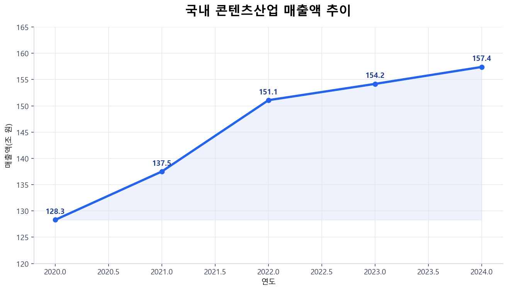
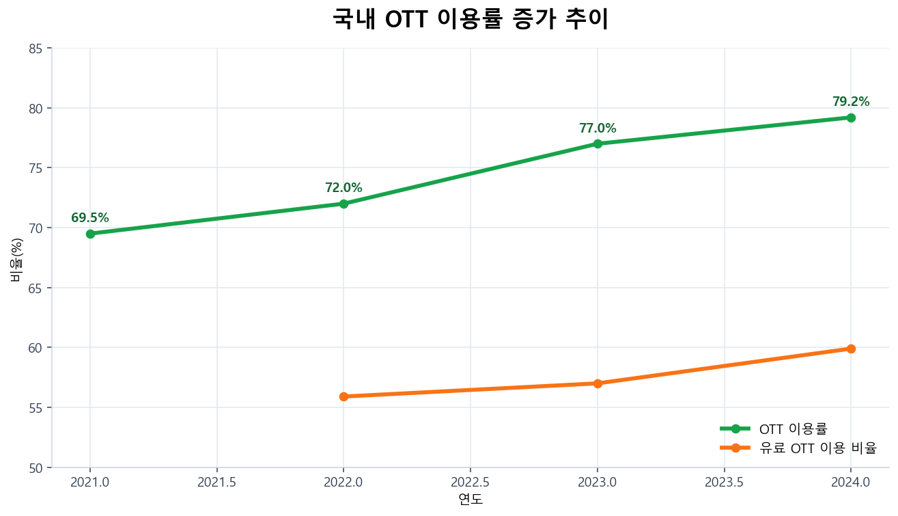

| 순서 | 섹션 | 핵심 내용 | 그래프/자료 |
|---|---|---|---|
| 1 | 기획 배경 | 시장성, 이용행태, 창작자 문제 정의 | `assets/data-bideo-*.png` |
| 2 | 데이터셋/피처 설계 | 학습 데이터 구성, 분포/상관 분석 | `Bideo-회귀_chart_1~3` |
| 3 | 분류 모델 | 저조회수/고조회수 분류, 임계값 조정 | `bideo-분류_chart_5/22/24` |
| 4 | 회귀 모델 | 조회수 예측, 오차/중요 피처 분석 | `Bideo-회귀_chart_4/5/6` |
| 5 | 유사도 추천 | Kiwi + TF-IDF 기반 콘텐츠 매칭 | `fastapi-slide-12.png` |
| 6 | LLM/RAG 분석 | Fast 모드 vs Hybrid RAG 모드 | `fastapi-slide-13.png` |
| 7 | 모델 비교/운영 | 기능별 모델 선택 기준과 운영 지표 | 비교표 + API 지표 |

# FastAPI AI 핵심 코드 발표 정리 (BIDEO 서비스 맞춤)

> 기준 프로젝트: `fastapi/workspaes/basic`  
> 목적: BIDEO 서비스의 AI 기능을 기획 근거부터 모델 비교까지 발표 순서로 한 번에 설명

## 1. 기획 배경 데이터 분석





- 시장 성장과 OTT 유료화 확대를 근거로 영상 콘텐츠 거래 서비스 타당성을 확보했습니다.
- 모바일/숏폼 중심 소비 패턴을 반영해 피드형 UX와 빠른 추천 응답을 우선 요구사항으로 잡았습니다.
- 창작자 수익 집중 문제를 해결하기 위해 조회수 외에 경매/결제 기반 수익모델을 함께 설계했습니다.

## 2. 데이터셋과 피처 설계

원본: `data-analysis/retrain_bideo_from_csv.py`, `data-analysis/retrain_bideo_from_db.py`


```python
# 서비스 입력 -> 모델 피처 벡터 정렬
feature_dict = features.model_dump()
values = [feature_dict[name] for name in self.work_regressor_features]
prediction = self.work_regressor.predict([values])
```

- 회귀/분류 공통으로 `likes`, `comments`, `shares`, `watch_completion_rate`, `ai_quality_score` 등 참여/품질 피처를 사용합니다.
- 로그 변환(`log_likes`, `log_comments`, `log_shares`)과 비율 피처(`like_ratio`, `comment_ratio`)로 heavy-tail 분포를 안정화했습니다.

## 3. 분류 모델 (고조회수 여부)

원본: `service/work_service.py`


```python
# 분류 추론 후 threshold 기준으로 클래스 결정
prob = self.work_classifier.predict_proba([values])[0][1]
label = int(prob >= self.classification_threshold)
```

- 기본 분류기보다 튜닝 + threshold 조정 모델이 정밀도/재현율 균형이 안정적입니다.
- 운영에서는 캠페인 목적에 따라 threshold를 조정합니다.
  - 노출 확대: recall 우선
  - 오탐 최소화: precision 우선

## 4. 회귀 모델 (조회수 예측)

원본: `service/work_service.py`


```python
self.load_work_regressor()
prediction = self.work_regressor.predict([values])
return WorkRegressionResponse(predicted_views=int(prediction[0]))
```

- 실측-예측 그래프로 전체 추세 추종 성능을 검증하고, 잔차 분포로 과대/과소 예측 편향을 점검합니다.
- 중요도 분석 결과 `like_ratio`, `likes`, `log_likes` 계열이 핵심 설명 변수로 작동합니다.

## 5. 유사도 추천 모델


원본: `service/work_recommend_service.py`

```python
tfidf_v = TfidfVectorizer(analyzer="char_wb", ngram_range=(2, 4), max_features=6000)
tfidf_mat = tfidf_v.fit_transform(work_texts)
query_mat = tfidf_v.transform([request.content])
sim_scores = cosine_similarity(query_mat, tfidf_mat)[0]
```

- Kiwi 전처리 + TF-IDF로 한국어 텍스트 유사도를 계산합니다.
- 콜드스타트 상황에서도 메타데이터 기반 추천이 가능해 초기 사용자 경험을 보완합니다.

## 6. LLM/RAG 분석 모델


원본: `service/auction_rag_service.py`

```python
if request.fast_mode:
    return await self._analyze_fast(request)

rag_query = self._build_rag_query(request, image_analysis)
auction_report = await rag.aquery(rag_query, mode="hybrid")
```

- `fast_mode`: 검색 단계를 줄여 응답속도 우선.
- `hybrid RAG`: 문서 근거 기반으로 가격 매력도, ROI 시나리오, 입찰 전략을 상세 생성.

## 7. 모델 비교 및 운영 적용

| 기능 | 적용 모델 | 선택 이유 | 핵심 운영 지표 |
|---|---|---|---|
| 조회수 예측 | LGBM Regressor (`bideo_regressor.pkl`) | 비선형 관계/스케일 차이를 안정적으로 학습 | MAE, RMSE, 잔차 왜도 |
| 고조회수 분류 | RF 계열 + threshold 조정 (`bideo_classifier.pkl`) | precision/recall 트레이드오프 제어 용이 | Precision, Recall, F1 |
| 콘텐츠 추천 | Kiwi + TF-IDF + Cosine | 실시간성/해석성/콜드스타트 대응 | CTR, 저장률, 재방문율 |
| 경매 분석 | Vision + LLM + Hybrid RAG | 근거 문서 기반 설명 가능 | 응답시간, 근거 일치율, 사용자 채택률 |

### API 기반 운영 대시보드 포인트

- 예측 API: `/api/work/regression` 응답을 일별 집계해 조회수 예측 추이 관리
- 분류 API: `/api/work/classification` 결과를 임계값별 precision/recall 리포트로 관리
- 추천 API: `/api/gallery/recommend`, `/api/work/recommend` CTR/전환율 모니터링
- RAG API: `/api/auction/rag/analyze` 응답시간/피드백 점수 모니터링

## 발표 마무리 한 줄

기획 데이터로 문제를 정의하고, 데이터셋/피처를 설계한 뒤, 분류·회귀·유사도·LLM/RAG를 기능별로 분리 적용해 BIDEO 서비스의 실제 의사결정과 수익 흐름에 연결한 구조입니다.
