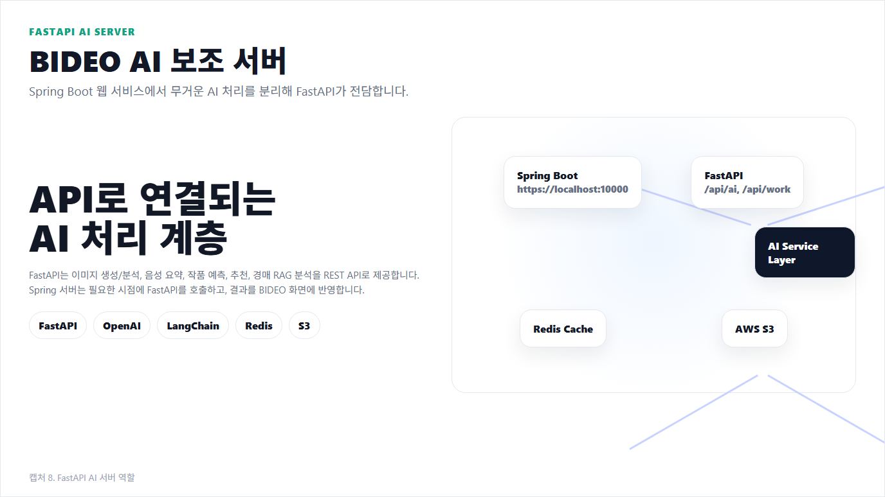
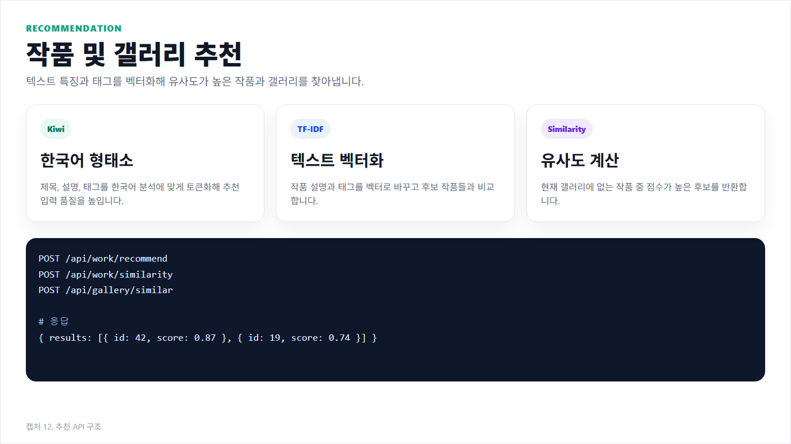

| 순서 | 섹션 | 핵심 내용 |
|---|---|---|
| 0 | 서비스/모델 기획 | 문제 정의, API 분리 이유, 모델 선택 기준 |
| 1 | FastAPI AI 서버 역할 | Spring 연동 구조와 라우터 분리 |
| 2 | 이미지 생성 및 분석 | 생성-분석-S3 저장 파이프라인 |
| 3 | 작품 성과 예측 | 회귀 모델 기반 조회수 예측 |
| 4 | 유사도 추천 | 텍스트 전처리 + TF-IDF 추천 |
| 5 | 경매 RAG 분석 | Fast 모드/Hybrid RAG 모드 분리 |
| 6 | 데이터 분석/운영 | 지표 설계, 성능 측정, 개선 루프 |
| 7 | 발표 흐름 요약 | 전체 구조 재정리 |

# FastAPI AI 핵심 코드 발표 정리

> 기준 문서: `발표/README.md`의 FastAPI AI 섹션  
> 기준 프로젝트: `fastapi/workspaes/basic`  
> 방향: AI 기능별 대표 이미지 1개와 핵심 코드만 짧게 정리

## 0. 서비스/모델 기획



원본: `main.py`, `router/*.py`, `service/*.py`

```python
from router import product, ai, work, gallery, auction_rag

app = FastAPI(lifespan=lifespan)
app.include_router(ai.router)
app.include_router(work.router)
app.include_router(gallery.router)
app.include_router(auction_rag.router)
```

AI 기능을 FastAPI로 분리해 배포 단위를 나누고, 기능별 라우터/서비스를 분리해 확장성과 장애 격리를 확보한 구조입니다.

## 1. FastAPI AI 서버 역할


원본: `main.py`

```python
from router import product, ai, work, gallery, auction_rag

app = FastAPI(lifespan=lifespan)
app.include_router(product.router)   # 기본 AI 기능을 연결합니다 / legacy product domain과의 하위 호환 라우팅입니다.
app.include_router(ai.router)        # 이미지 생성과 분석 엔드포인트를 묶었습니다 / image generation, vision analysis, orchestration router입니다.
app.include_router(work.router)      # 작품 성과 예측을 연결했습니다 / regression, classification inference endpoint입니다.
app.include_router(gallery.router)   # 예술관 추천을 연결했습니다 / content-based similarity recommendation router입니다.
app.include_router(auction_rag.router) # 경매 분석을 연결했습니다 / auction domain RAG pipeline router입니다.
```

Spring Boot가 무거운 AI 작업을 직접 처리하지 않고, FastAPI가 전담하는 구조입니다.

## 2. 이미지 생성 및 분석


원본: `service/ai_service.py`

```python
async def run_image_pipeline(self, request: ImagePipelineRequest) -> ImagePipelineResponse:
    return await run_in_threadpool(self._run_image_pipeline, request)

def _run_image_pipeline(self, request: ImagePipelineRequest) -> ImagePipelineResponse:
    image_path = self._generate_image_file(  # 이미지를 생성합니다 / OpenAI image generation model을 호출해서 local artifact를 만들었습니다.
        prompt=request.prompt,
        size=request.size
    )
    description, cache_hit = self._analyze_image_with_cache(str(image_path))  # 생성된 이미지를 분석합니다 / vision inference 결과를 cache-aware하게 재사용했습니다.
    uploaded_image = self._upload_image_to_s3(image_path)  # 이미지를 S3에 저장합니다 / object storage에 업로드하고 key와 presigned URL 메타데이터를 확보했습니다.

    return ImagePipelineResponse(
        image_path=str(image_path),
        description=description,
        image_key=uploaded_image["key"],
        image_url=uploaded_image["url"],
        file_type=uploaded_image["content_type"],
        file_size=uploaded_image["size"]
    )
```

프롬프트를 받아 이미지를 만들고, 바로 분석한 뒤, S3 key와 presigned URL까지 반환합니다.

## 3. 작품 성과 예측


원본: `service/work_service.py`

```python
async def predict_views(self, features: WorkRegressionFeatures) -> WorkRegressionResponse:
    self.load_work_regressor()  # 예측 모델을 불러옵니다 / joblib/pkl serialized estimator를 lazy-load해서 재사용했습니다.

    feature_dict = features.model_dump()
    values = [feature_dict[name] for name in self.work_regressor_features]  # 입력값 순서를 맞춥니다 / training schema order에 맞춰 feature vector를 정렬했습니다.
    prediction = self.work_regressor.predict([values])

    return WorkRegressionResponse(
        predicted_views=int(prediction[0]),
        created_datetime=datetime.now(),
        updated_datetime=datetime.now()
    )
```

회귀 모델은 저장된 pkl과 feature 순서를 맞춰 예상 조회수를 계산하고, 첫 호출 이후에는 메모리 재사용으로 성능을 확보합니다.

## 4. 유사도 추천



원본: `service/work_recommend_service.py`

```python
work_texts = [
    f"{r['title']} {r['title']} {r['category']} {r['description']} {r['tags']}"
    for r in rows
]

tfidf_v = TfidfVectorizer(
    analyzer="char_wb",     # 한국어 유사도를 계산합니다 / 형태소 분해 대신 character n-gram 기반 vectorizer를 사용했습니다.
    ngram_range=(2, 4),
    max_features=6000,
)
tfidf_mat = tfidf_v.fit_transform(work_texts)
query_mat = tfidf_v.transform([request.content])
sim_scores = cosine_similarity(query_mat, tfidf_mat)[0]  # 추천 점수를 계산합니다 / query-document similarity를 dense score로 산출했습니다.
```

제목, 설명, 태그를 하나의 텍스트로 합치고, Kiwi 기반 전처리와 TF-IDF 유사도 계산으로 추천 점수를 만듭니다.

## 5. 경매 RAG 분석


원본: `service/auction_rag_service.py`

```python
async def analyze(self, request: AuctionRagAnalyzeRequest) -> AuctionRagAnalyzeResponse:
    if request.fast_mode:
        return await self._analyze_fast(request)  # 빠른 분석 경로를 사용합니다 / retrieval step을 생략한 low-latency path입니다.

    rag = await self.get_rag()                  # RAG 분석기를 준비합니다 / RAG runtime을 lazy-init하고 connection pool처럼 재사용했습니다.
    image_data = self._resolve_image_base64(request)
    image_analysis = await rag.vision_model_func(
        self._build_image_prompt(request),
        image_data=image_data,
    )

    rag_query = self._build_rag_query(request, image_analysis)
    auction_report = await rag.aquery(rag_query, mode="hybrid")  # 문서 기반 정밀 분석을 수행합니다 / dense/sparse retrieval과 generation을 결합한 hybrid RAG를 사용했습니다.

    return AuctionRagAnalyzeResponse(
        image_analysis=str(image_analysis),
        auction_report=str(auction_report),
        used_rag=True,
        indexed_document_hint=str(DEFAULT_REPORT_PATH),
    )
```

빠른 모드와 RAG 모드를 분리해서, 즉시 응답과 문서 기반 정밀 분석을 모두 지원합니다.

## 6. 데이터 분석/운영


원본: `service/work_service.py`, `service/work_recommend_service.py`, `service/auction_rag_service.py`

```python
prediction = self.work_regressor.predict([values])
sim_scores = cosine_similarity(query_mat, tfidf_mat)[0]
auction_report = await rag.aquery(rag_query, mode="hybrid")
```

운영에서는 예측값 정확도(MAE/RMSE), 추천 반응률(CTR), RAG 응답시간/재현율 같은 지표를 함께 보며 모델과 프롬프트를 반복 개선합니다.

## 7. 발표 흐름 요약

1. 기획 단계에서 AI 기능을 FastAPI로 분리하고 기능별 라우터를 설계했습니다.
2. 이미지 생성은 생성, 분석, S3 저장을 한 번에 묶어 처리합니다.
3. 작품 예측은 저장된 pkl 모델과 feature 순서를 그대로 사용합니다.
4. 추천은 텍스트 유사도 기반으로 후보를 정렬합니다.
5. 경매 분석은 빠른 모드와 RAG 정밀 모드를 분리했습니다.
6. 운영 단계에서 정확도/반응률/지연시간 지표로 지속 개선합니다.

